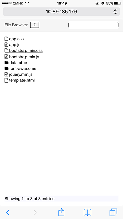
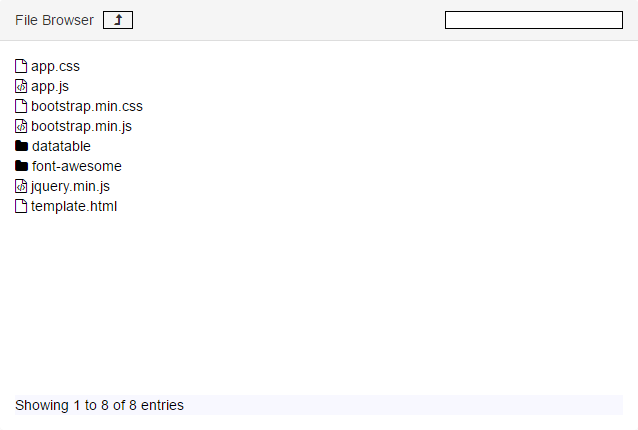

# Beautiful Node.js File Browser

This project is a web-based file browser for browsing and downloading files on your file system. Using this you can share files between different machines, and across different operating systems. 

## Installation

```
npm -g install file-browser-nice
```

## How to Run

Change directory to the directory you want to browse. Then run the following command in that directory.

```
file-browser-nice
```

You would see the message "*Please open the link in your browser http://<YOUR-IP>:7000*" in your console.

Other settings:

```
-p, --port <port>        Port to run the file browser. Default value is 7000.
-e, --exclude <exclude>  File extensions to exclude. To exclude multiple extensions, pass -e multiple times. e.g.: -e .js -e .cs -e .swp.
``` 

## Screenshots


